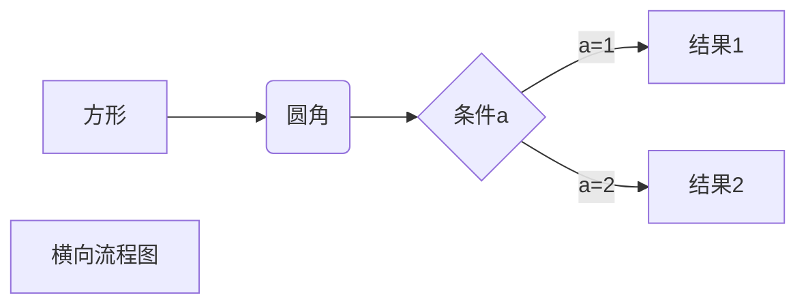
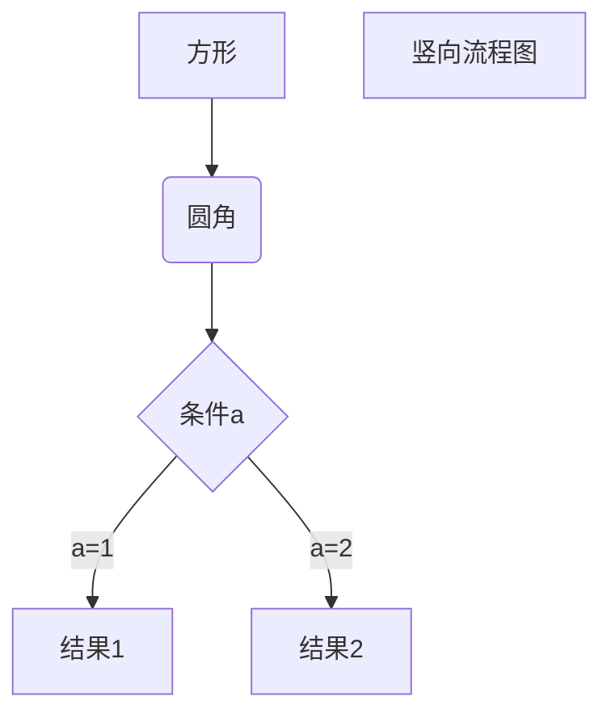
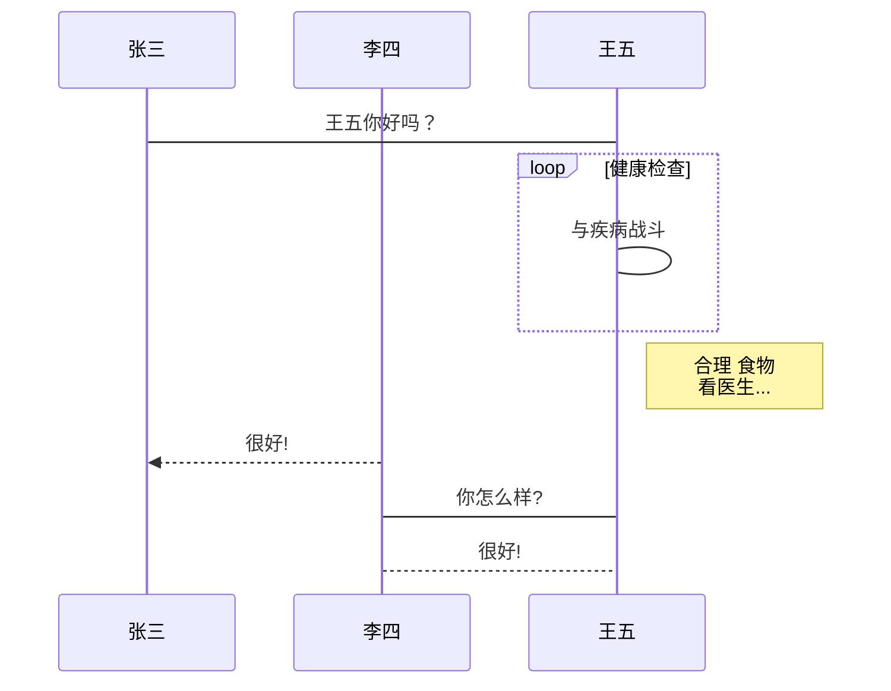
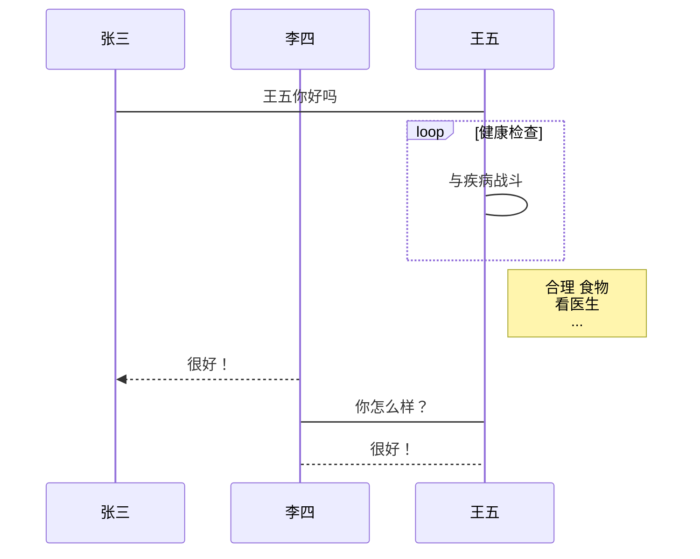
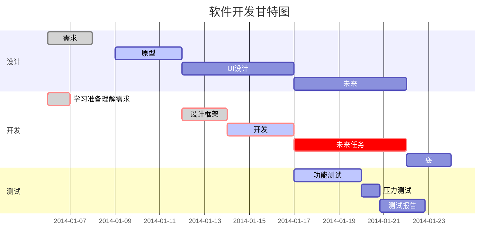

# MarkDown 学习

虽然已经使用 `Typora` 写了不少文档，但是看到一个 `MD` 教程，太骚了，必须得学一下

`MarkDown` 有多方便就不说了，主要是简洁大方，还支持各种公式如Latex，以及图片的插入。

直接开始学习


## 1 标题

标题可以使用 `#` 来编写，其数量越多，标题等级越小。

也可以使用 `=` 或 `-` 组成的长线来编写

    一级标题
    =
    
    二级标题
    -

一级标题
=

二级标题
-


## 2 段落

段落的换行一般是使用一个空行

**字体**

    *斜体文本*
    _斜体文本_
    **粗体文本**
    __粗体文本__
    ***粗斜体文本***
    ___粗斜体文本___

*斜体文本*
_斜体文本_
**粗体文本**
__粗体文本__
***粗斜体文本***
___粗斜体文本___

***


**分隔线**

    ***
    * * *
    *****
    - - -
    --------

***

* * *

*****

- - -

--------


**删除线**

    ~~删除线~~

~~删除线~~


**下划线**

    <u>下划线<u>

<u>下划线</u>


**脚注**

    [^要注明的文本]

注意脚注要上下对应

创建脚注格式类似这样 [^对应]。

[^对应]: 这是类似于参考文献的脚注


## 3 列表

无序列表

    * 第一项
    * 第二项
    * 第三项
    
    + 第一项
    + 第二项
    + 第三项
    
    - 第一项
    - 第二项
    - 第三项

* 第一项
* 第二项
* 第三项

+ 第一项
+ 第二项
+ 第三项


- 第一项
- 第二项
- 第三项


有序列表

    1. 第一项
    2. 第二项
    3. 第三项

1. 第一项
2. 第二项
3. 第三项


嵌套列表

    1. 一
        - 1.1
          - 1.1.1
    2. 二
        - nihao
            1. 这是

1. 一
   - 1.1
     - 1.1.1
2. 二
   - nihao
     1. 这是


## 4 区块

区块引用使用 `> ` 

    > 区块
    > 示例


> 区块
> 示例


也可以实现嵌套

    > 一
    > > 二
    > > > 三

> 一
>
> > 二
> >
> > > 三


还可以配合列表使用

    > 区块中使用列表
    > 1. 第一项
    > 2. 第二项
    > - 第一项

> 区块中使用列表
>
> 1. 第一项
> 2. 第二项
>
> + 第一项

    * 第一项
    > 区块
    > 区块
    * 第二项

* 第一项

  > 区块
  > 区块

* 第二项


## 5 代码

可以使用四个空格后者一个 `Tab` 展开代码块

也可以使用 ```  来包裹代码并指定语言

```
```python
print("hello")
```

```
```python
print("hello")
```


## 6 链接

```
[链接名称](链接地址)
[百度](baidu.com)
或者
<链接地址>
<baidu.com>
```

[链接名称](链接地址)
[百度](baidu.com)
或者
<链接地址>
<baidu.com>


高级链接


```
这个链接用 1 作为网址变量 [Google][1]
这个链接用 link 作为网址变量 [Link][link]
然后在文档的结尾为变量赋值（网址）

  [1]: http://www.google.com/
  [link]: http://www.runoob.com/

```


这个链接用 1 作为网址变量 [Google][1]

这个链接用 link 作为网址变量 [Link][link]

然后在文档的结尾为变量赋值（网址）

[1]: http://www.google.com/
[link]: http://www.runoob.com/


## 7 图片

```


```


也可以直接使用 HTML 图片格式

```

```


## 8 表格


表格使用 `|` 来分隔不同的单元格，使用 `-` 来分隔表头和其他行


```
|表头|表头|
|--|--|
|单元格|单元格|
|单元格|单元格|
```

| 表头   | 表头   |
| ------ | ------ |
| 单元格 | 单元格 |
| 单元格 | 单元格 |


表格对齐


```
| 左对齐 | 右对齐 | 居中对齐 |
| :-----| ----: | :----: |
| 单元格 | 单元格 | 单元格 |
| 单元格 | 单元格 | 单元格 |
```

| 左对齐----- | 右对齐----- | 居中对齐---- |
| :---------- | ----------: | :----------: |
| 单元格      |      单元格 |    单元格    |
| 单元格      |      单元格 |    单元格    |


## 9 高级技巧

**HTML**

```目前支持的 HTML 元素有：<kbd> <b> <i> <em> <sup> <sub> <br>等```

<kbd>Ctrl</kbd> + <kbd>C</kbd>


**转义**
支持符号前面加上反斜杠来帮助插入普通的符号

\```


**公式**

使用 KaTeX 或者 MathJax 来渲染数学表达式

```
行内 $f(x)=\frac{1}{x}$

$$f(x)=\frac{1}{e^x}$$
```

行内 $f(x)=\frac{1}{x}$

$$f(x)=\frac{1}{e^x}$$


```
$$
\begin{Bmatrix}
   a & b \\
   c & d 
\end{Bmatrix}
$$

$$
\begin{CD}
   A @>a>> B \\
@VbVV @AAcA \\
   C @= D
\end{CD}
$$
```

$$
\begin{Bmatrix}
   a & b \\
   c & d \\
   e & f
\end{Bmatrix}
$$

$$
\begin{CD}
   A @>a>> B \\
@VbVV @AAcA \\
   C @= D
\end{CD}
$$


## 10 绘图

### 横向流程图

````

````


### 竖向流程图

````

````


### 标准流程图

````
```flow
st=>start: 开始框
op=>operation: 处理框
cond=>condition: 判断框(是或否?)
sub1=>subroutine: 子流程
io=>inputoutput: 输入输出框
e=>end: 结束框
st->op->cond
cond(yes)->io->e
cond(no)->sub1(right)->op
```
````

```flow
st=>start: start
op=>operation: 处理
cond=>condition: 判断
sub1=>subroutine: 子流程
io=>inputoutput: io
e=>end: 结束

st->op->cond
cond(yes)->io->e
cond(no)->sub1(right)->op
```


### 横向标准流程图

````
```flow
st=>start: 开始框
op=>operation: 处理框
cond=>condition: 判断框(是或否?)
sub1=>subroutine: 子流程
io=>inputoutput: 输入输出框
e=>end: 结束框
st(right)->op(right)->cond
cond(yes)->io()->e
cond(no)->sub1(right)->op
```
````

```flow
st=>start: 开始框
op=>operation: 处理框
cond=>condition: 判断框(是或否?)
sub1=>subroutine: 子流程
io=>inputoutput: 输入输出框
e=>end: 结束框

st(right)->op(right)->cond
cond(yes)->io->e
cond(no)->sub1(right)->op
```


### UML时序图

````
```sequence
对象A->对象B: 对象B你好吗?（请求）
Note right of 对象B: 对象B的描述
Note left of 对象A: 对象A的描述(提示)
对象B-->对象A: 我很好(响应)
对象A->对象B: 你真的好吗？
```
````

```sequence
对象A->对象B: 对象B你好吗?（请求）
Note right of 对象B: 对象B的描述
Note left of 对象A: 对象A的描述(提示)
对象B-->对象A: 我很好(响应)
对象A->对象B: 你真的好吗？
```


### UML时序图复杂

````
```sequence
Title: 标题：复杂使用
对象A->对象B: 对象B你好吗?（请求）
Note right of 对象B: 对象B的描述
Note left of 对象A: 对象A的描述(提示)
对象B-->对象A: 我很好(响应)
对象B->小三: 你好吗
小三-->>对象A: 对象B找我了
对象A->对象B: 你真的好吗？
Note over 小三,对象B: 我们是朋友
participant C
Note right of C: 没人陪我玩
```
````

```sequence
Title: 标题：复杂样例
对象A->对象B: 对象B你好吗?（请求）
Note right of 对象B: 对象B的描述
Note left of 对象A: 对象A的描述(提示)
对象B-->对象A: 我很好(响应)
对象B->小三: 你好吗
小三-->>对象A: 对象B找我了
对象A->对象B: 你真的好吗？
Note over 小三,对象B: 我们是朋友
participant C
Note right of C: 没人陪我玩
```


### UML标准时序图

````

````




### 甘特图

````

````



